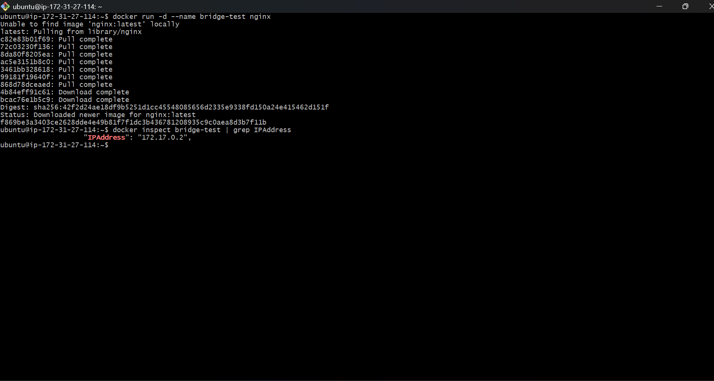
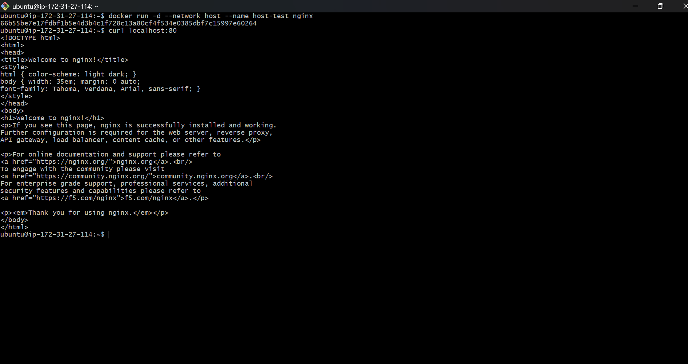
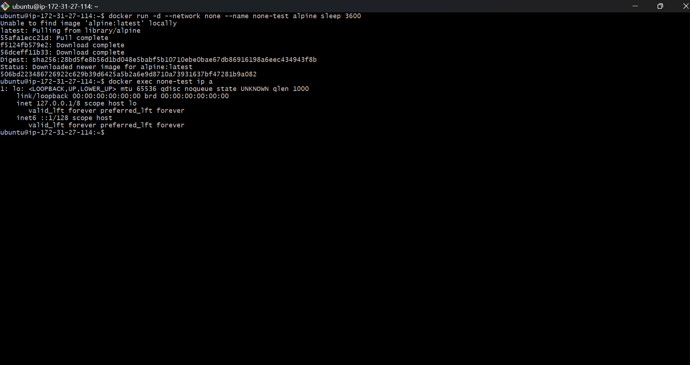
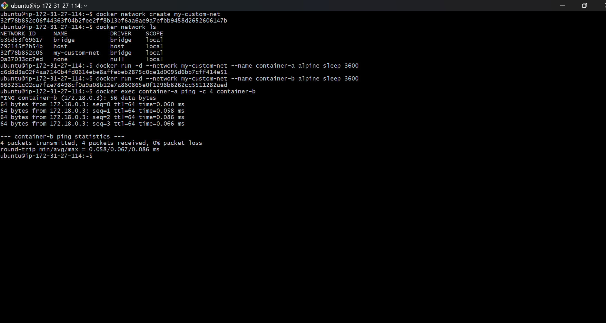

# Install Docker on an AWS EC2 instance.
## Screenshots


## Code 
```bash
sudo apt remove $(dpkg --get-selections docker.io docker-compose docker-compose-v2 docker-doc podman-docker containerd runc | cut -f1)
# Add Docker's official GPG key:
sudo apt update
sudo apt install ca-certificates curl
sudo install -m 0755 -d /etc/apt/keyrings
sudo curl -fsSL https://download.docker.com/linux/ubuntu/gpg -o /etc/apt/keyrings/docker.asc
sudo chmod a+r /etc/apt/keyrings/docker.asc

# Add the repository to Apt sources:
sudo tee /etc/apt/sources.list.d/docker.sources <<EOF
Types: deb
URIs: https://download.docker.com/linux/ubuntu
Suites: $(. /etc/os-release && echo "${UBUNTU_CODENAME:-$VERSION_CODENAME}")
Components: stable
Architectures: $(dpkg --print-architecture)
Signed-By: /etc/apt/keyrings/docker.asc
EOF

sudo apt update
# To install the latest version, run:
sudo apt install docker-ce docker-ce-cli containerd.io docker-buildx-plugin docker-compose-plugin
# Start Docker Service
1.sudo systemctl status docker
2.sudo systemctl start docker
3.sudo systemctl enable docker

```
# Configure Docker Permissions
## Add current user to docker group (no more sudo needed!)
sudo usermod -aG docker $USER

## Apply group changes (logout/login or use newgrp)
newgrp docker

## Verify you can run docker without sudo
docker ps

## Screenshots


# Run the hello-world Docker image and verify successful execution.
## Screenshots


# Explain and demonstrate the following Docker network types:
## What is Docker network
A Docker network is a communication system that allows Docker containers to talk to each other, communicate with the host machine, and access external networks like the internet.
## Docker Network
1.Bridge
2.Host 
3.none

## Default Bridge Network
Explanation: The default network driver. If you don't specify a network, containers are attached to this bridge. Containers on the default bridge can communicate via IP address, and they access the external internet through a NAT firewall on the host.
Lab Exercise:
## Run an Nginx container on the default bridge
docker run -d --name bridge-test nginx
## Inspect the container to view its assigned IP address
docker inspect bridge-test | grep IPAddress

Note:Default Bridge network no need to mention port etc

## Host Network
Explanation: This driver removes network isolation between the Docker container and the Docker host. The container shares the host's networking namespace, meaning it uses the host's IP address and port space directly.
# Run an Nginx container using the host network
docker run -d --network host --name host-test nginx
# Check the host's listening ports (Nginx will be listening directly on the host's port 80)
curl localhost:80


## None Network
Explanation: This provides maximum isolation. The container gets its own network namespace but has no network interfaces attached to it (other than the local loopback interface, lo). It cannot communicate with the outside world or other containers.
Lab Exercise:
# Run a lightweight alpine container with no network
docker run -d --network none --name none-test alpine sleep 3600
# Execute a command inside the container to list network interfaces
docker exec none-test ip a

Note:Nobody can access from outside and secure

## Custom Bridge Network
Explanation: User-defined bridge networks are superior to the default bridge because they provide automatic DNS resolution between containers. Containers can communicate using their container names rather than relying on dynamic IP addresses.
Lab Exercise:
## Create a custom bridge network
docker network create my-custom-net
## Run two containers attached to this new network
docker run -d --network my-custom-net --name container-a alpine sleep 3600
docker run -d --network my-custom-net --name container-b alpine sleep 3600
## Ping container-b from inside container-a using the container's NAME
docker exec container-a ping -c 4 container-b


