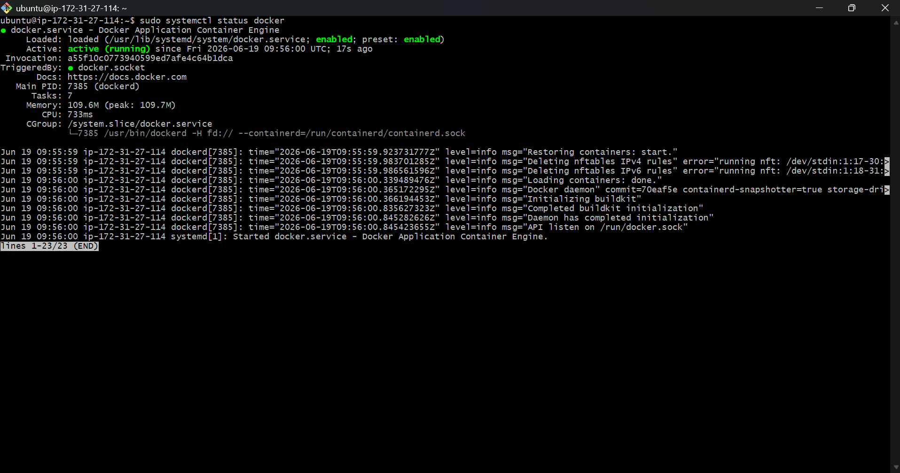
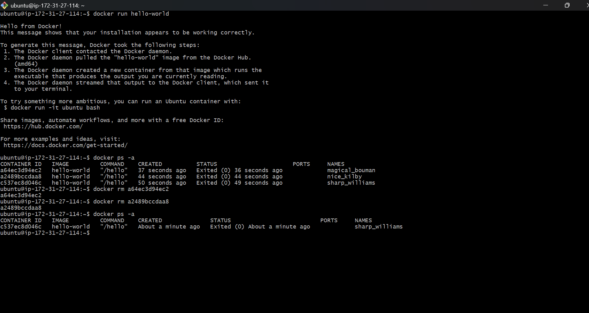

# Install Docker on an AWS EC2 instance.
## Screenshots


## Code 

```bash
sudo apt remove $(dpkg --get-selections docker.io docker-compose docker-compose-v2 docker-doc podman-docker containerd runc | cut -f1)
# Add Docker's official GPG key:
sudo apt update
sudo apt install ca-certificates curl
sudo install -m 0755 -d /etc/apt/keyrings
sudo curl -fsSL https://download.docker.com/linux/ubuntu/gpg -o /etc/apt/keyrings/docker.asc
sudo chmod a+r /etc/apt/keyrings/docker.asc

# Add the repository to Apt sources:
sudo tee /etc/apt/sources.list.d/docker.sources <<EOF
Types: deb
URIs: https://download.docker.com/linux/ubuntu
Suites: $(. /etc/os-release && echo "${UBUNTU_CODENAME:-$VERSION_CODENAME}")
Components: stable
Architectures: $(dpkg --print-architecture)
Signed-By: /etc/apt/keyrings/docker.asc
EOF

sudo apt update
# To install the latest version, run:
sudo apt install docker-ce docker-ce-cli containerd.io docker-buildx-plugin docker-compose-plugin
# Start Docker Service
1.sudo systemctl status docker
2.sudo systemctl start docker
3.sudo systemctl enable docker

```
# Configure Docker Permissions
## Add current user to docker group (no more sudo needed!)
sudo usermod -aG docker $USER

## Apply group changes (logout/login or use newgrp)
newgrp docker

## Verify you can run docker without sudo
docker ps

## Screenshots


# Run the hello-world Docker image and verify successful execution.

